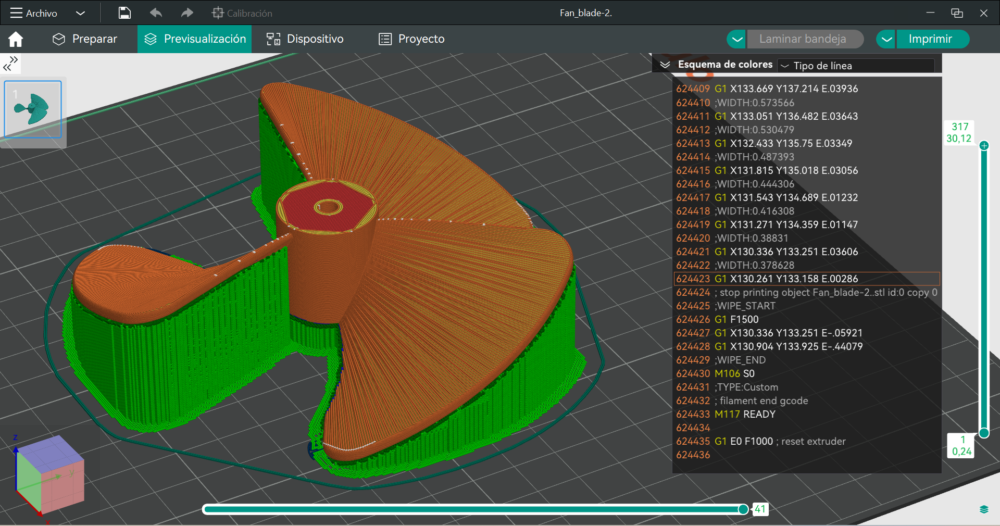

# FanBlades
Archivos STL para impresion de aspas de ventiladores.

# Fuente
Este trabajo es una modificación personal sobre el trabajo de [mdombro3](https://www.thingiverse.com/mdombro3) [Fan Blade](https://www.thingiverse.com/thing:322873)

## License

This file is part of FanBlades.

FanBlades is free software: you can redistribute it and/or modify it under the terms of the GNU General Public License as published by the Free Software Foundation, either version 3 of the License, or (at your option) any later version.

FanBlades is distributed in the hope that it will be useful, but WITHOUT ANY WARRANTY; without even the implied warranty of MERCHANTABILITY or FITNESS FOR A PARTICULAR PURPOSE.  See the GNU General Public License for more details.

You should have received a copy of the GNU General Public License along with FanBlades.  If not, see <https://www.gnu.org/licenses/>.

